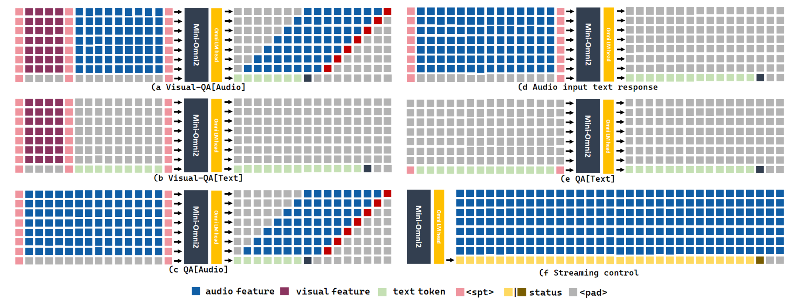
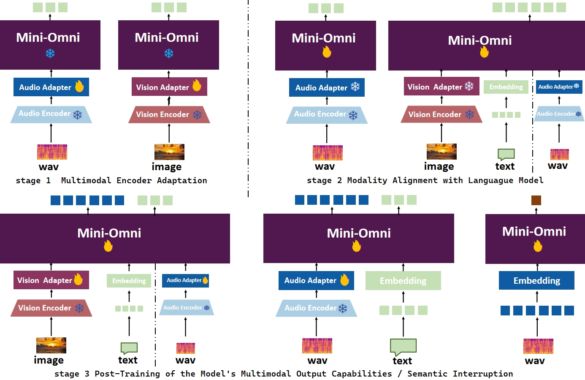
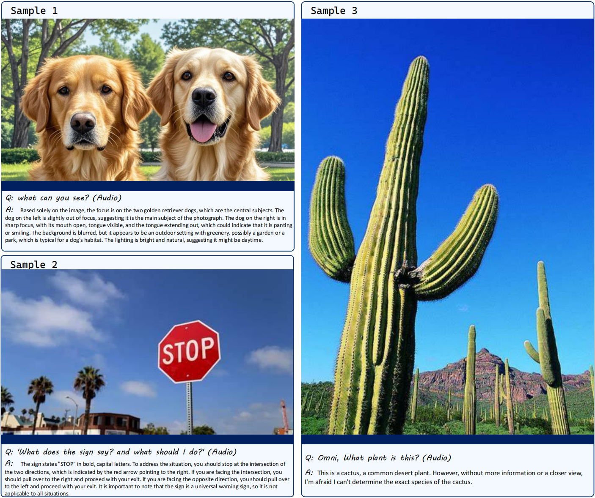

# Mini-Omni2

<p align="center">
    
</p>


<p align="center">
🤗 <a href="https://huggingface.co/gpt-omni/mini-omni2">Hugging Face</a>   | 📖 <a href="https://github.com/gpt-omni/mini-omni2">Github</a> 
|     📑 <a href="https://arxiv.org/abs/2410.11190">Technical report</a> 
</p>

<h5 align="center"> If you like little Omni2, please give us a star⭐ and cite our <a href="(https://arxiv.org/abs/2410.11190)">paper</a>!</h2>

## Introduction
Mini-Omni2 is an **omni-interactive** model. It can **understand image, audio and text inputs and has end-to-end voice conversations with users**. Featuring **real-time voice output**, **omni-capable multimodal understanding** and flexible interaction **ability with interruption mechanism while speaking**.

<p align="center">
    
</p>


## Updates

- **2024.10:** Release the model, technical report, inference and chat demo code.

## Features
✅ **Multimodal interaction**: with the ability to understand images, speech and text, just like GPT-4o.

✅ **Real-time speech-to-speech** conversational capabilities. No extra ASR or TTS models required, just like [Mini-Omni](https://github.com/gpt-omni/mini-omni).

<!-- ✅ **Streaming audio output**: with first-chunk latency of audio stream less than 0.3s. -->

<!-- ✅ **Duplex interaction**: hearing while speaking, it can be interrupted by key words like "stop omni". -->


## Demo

NOTE: need to unmute first.

https://github.com/user-attachments/assets/ad97ca7f-f8b4-40c3-a7e8-fa54b4edf155


## ToDo
- [ ] update interruption mechanism


## Install

Create a new conda environment and install the required packages:

```sh
conda create -n omni python=3.10
conda activate omni

git clone https://github.com/gpt-omni/mini-omni2.git
cd mini-omni2
pip install -r requirements.txt
```

## Quick start

**Interactive demo**

- start server

NOTE: you need to start the server before running the streamlit or gradio demo with API_URL set to the server address.

```sh
sudo apt-get install ffmpeg
conda activate omni
cd mini-omni2
python3 server.py --ip '0.0.0.0' --port 60808
```


- run streamlit demo

NOTE: you need to run streamlit **locally** with PyAudio installed. 

```sh
pip install PyAudio==0.2.14
API_URL=http://0.0.0.0:60808/chat streamlit run webui/omni_streamlit.py
```


**Local test**

```sh
conda activate omni
cd mini-omni2
# test run the preset audio samples and questions
python inference_vision.py
```

## Mini-Omni2 Overview

**1. Multimodal Modeling**:
We use multiple sequences as the input and output of the model. In the input part, we will concatenate image, audio and text features to perform a series of comprehensive tasks, as shown in the following figures. In the output part, we use text-guided delayed parallel output to generate real-time speech responses.
<p align="center">
    
</p>

**2. Multi-stage Training**:
We propose an efficient alignment training method and conduct encoder adaptation, modal alignment, and multimodal fine-tuning respectively in the three-stage training.
<p align="center">
    
</p>

<!-- **3. Cases**:
Here are more cases of Mini-Omni2:
<p align="center">
    
</p> -->

## FAQ

**1. Does the model support other languages?**

No, the model is only trained on English. However, as we use whisper as the audio encoder, the model can understand other languages which is supported by whisper (like chinese), but the output is only in English.

**2. Error: can not run streamlit in local browser, with remote streamlit server**
    
You need start streamlit **locally** with PyAudio installed.


## Acknowledgements 

- [Qwen2](https://github.com/QwenLM/Qwen2/) as the LLM backbone.
- [litGPT](https://github.com/Lightning-AI/litgpt/) for training and inference.
- [whisper](https://github.com/openai/whisper/)  for audio encoding.
- [clip](https://github.com/openai/CLIP)  for image encoding.
- [snac](https://github.com/hubertsiuzdak/snac/)  for audio decoding.
- [CosyVoice](https://github.com/FunAudioLLM/CosyVoice) for generating synthetic speech.
- [OpenOrca](https://huggingface.co/datasets/Open-Orca/OpenOrca) and [MOSS](https://github.com/OpenMOSS/MOSS/tree/main) for alignment.

## Citation

```bibtex
@article{xie2024miniomni2opensourcegpt4ovision,
      title={Mini-Omni2: Towards Open-source GPT-4o with Vision, Speech and Duplex Capabilities}, 
      author={Zhifei Xie and Changqiao Wu},
      year={2024},
      eprint={2410.11190},
      archivePrefix={arXiv},
      primaryClass={eess.AS},
      journal={ArXiv},
      volume={abs/2410.11190},
}
```
## Star History
[](https://star-history.com/#gpt-omni/mini-omni2&Date)
